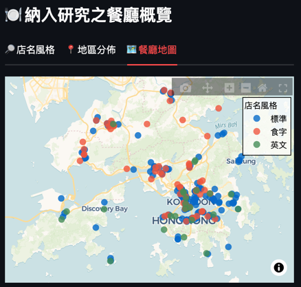
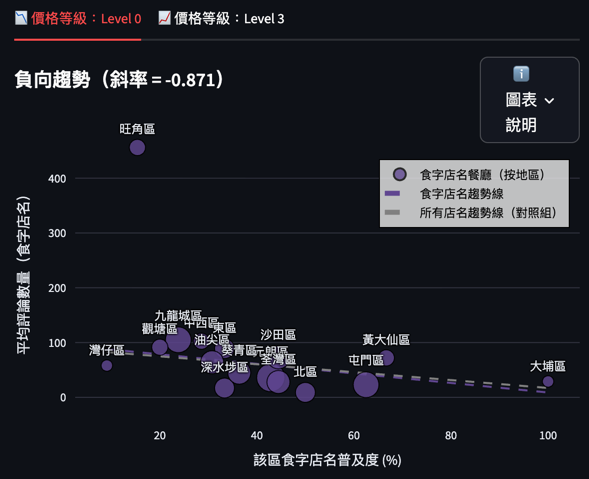

### 🔗 項目連結 (Project Link): https://thai-restaurants-analysis.streamlit.app

---

## 🇹🇭 泰好味＝泰高分？香港泰菜食字店名口碑與人氣之數據分析
### (Pun Intended? A Data Analysis of Naming Styles on Thai Restaurant Popularity in Hong Kong)

## 📌 項目簡介 (Project Overview)
本項目是一個數碼人文的初步實踐項目，抓取香港 200 多間泰國餐廳的命名及商業數據，探討「諧音食字」這種在地語言特徵與創意策略，如何影響餐廳的商業口碑與市場人氣。

This project is a preliminary practice in Digital Humanities. By analyzing data from over 200 Thai restaurants in Hong Kong, it investigates how "phonetic puns", a distinct local linguistic and creative strategy, impact commercial reputation and market popularity.

## 🔬 項目方法論 (Methodology)
本項目建立了一套自定義規則，對餐廳名稱進行結構化分析：

This project employs "Developer-defined Rules" to perform structured processing and analysis of textual data:

1. **自定義規則分類 (Custom Heuristic Rules)**：
   - 針對廣東話語言特徵編寫邏輯，將店名分類為：「食字/諧音」、「普通」及「英文」。
   - Developed logical rules based on Cantonese linguistic features to categorize restaurant names into "Puns", "Normal", and "English".

2. **定量分佈分析 (Quantitative Analysis)**：
   - 利用 Python (Pandas) 統計各類命名的市場佔比，並對比 Google 評分及評論總數，分析命名風格與受歡迎程度的關係。
   - Utilized Python (Pandas) to analyze the market share of different naming styles and perform correlation analysis against Google ratings and review volume to explore the impact of naming on market popularity.

3. **地理空間視覺化 (Geospatial Analysis)**：
   - 參照 **空間數據共享平台（CSDI）** 的分區標準，將命名數據與地理座標結合，分析不同區域之間的命名策略差異。
   - Integrated CSDI spatial standards and geographic coordinates to visualize the spatial distribution of naming strategies across districts.

4. **互動式儀表板（Interactive Dashboard）**：
   - 使用 **Streamlit** 開發雙語互動式儀表版，直觀對比不同地區的命名規律與口碑。
   - Developed a bilingual dashboard using Streamlit to visualize the relationship between naming patterns and restaurant reputations across districts.

## 📈 核心發現 (Key Insights)

* **創意命名的空間飽和效應 (Spatial Saturation Effect)**：
   - 數據顯示，在食字餐廳分佈密度較高的「飽和地區」，平價食字餐廳的優勢反而遞減。這反映出在激烈競爭下，品牌策略會由「吸引注意」轉向建立專業感與差異化。
   - Data reveals that in "saturated areas" with high restaurant density of pun-based restaurants, the competitive advantage of budget restaurants named by puns diminishes. This suggests a strategic pivot from "attention-seeking" to "professionalism and brand differentiation" in highly competitive markets.

## 🛠️ 技術棧 (Tech Stack)
- **Programming**: Python (Pandas)
- **Language Logic**: Custom Heuristic Rules (Regex)
- **Visualization**: Plotly
- **Web Interface**: Streamlit
- **Data Source**: 空間數據共享平台（CSDI）, Google Places API
